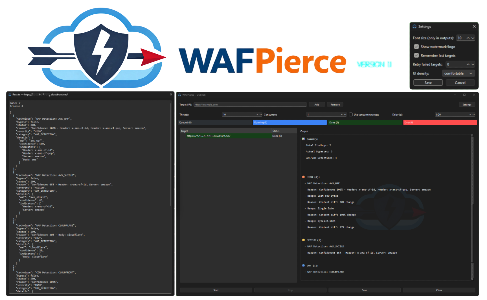

<div align="center">
  
  
  <h1>WAFPierce</h1>
  <b>CloudFront WAF Bypass & Penetration Testing Tool</b>
  <br><br>
  <a href="https://img.shields.io/badge/version-1.4-blue"></a>
  <a href="https://img.shields.io/badge/python-3.8+-green"></a>
  <a href="https://img.shields.io/badge/license-MIT-orange"></a>
</div>

---

<details>
<summary><b>Table of Contents</b></summary>

- [What is WAFPierce?](#what-is-wafpierce)
- [Key Features](#key-features)
- [Changelog](#changelog)
- [Installation](#installation)
- [Usage](#usage)
- [Bypass Techniques](#bypass-techniques)
- [Future Roadmap](#future-roadmap)
- [Requirements](#requirements)
- [Responsible Disclosure](#responsible-disclosure)
- [Educational Resources](#educational-resources)
- [Authors](#authors)
- [Legal Disclaimer](#legal-disclaimer)

</details>

---

## What is WAFPierce?

WAFPierce is a powerful WAF/CDN assessment and bypass validation tool for penetration testing and security research.

It fingerprints 17+ WAF vendors and 12+ CDN providers, then tests <b>100+ bypass/evasion techniques</b> using baseline + heuristic comparisons (status codes, response size, hashes) to confirm real bypasses—even when defenses return OK.

It also supports rate-limit detection, API endpoint and directory discovery, protocol-level testing (request smuggling, HTTP/2 downgrade, WebSocket tunneling), comprehensive injection testing (SQLi, XSS, SSRF, NoSQL, LDAP, XXE, SSTI, Log4Shell), cloud-specific tests, a clean GUI, optimized parallel performance, and automated Markdown reporting.

<p align="center">
  <b>▶️ <a href="https://youtu.be/O_iT_AuvczY">Watch the Trailer</a></b>
</p>

---

## Key Features

<details>
<summary><b>Click to expand full feature list</b></summary>

- <b>WAF Detection & Fingerprinting</b> — Identifies 17+ WAF vendors (Cloudflare, AWS WAF, Akamai, Imperva, F5, Sucuri, ModSecurity, and more)
- <b>CDN Detection</b> — Detects 12+ CDN providers (CloudFront, Akamai, Fastly, Cloudflare, etc.)
- <b>WAF Bypass Detection</b> — Tests 100+ different bypass techniques
- <b>Smart WAF Bypass</b> — Uses baseline comparison and heuristic analysis (size, hash, status codes) to detect bypasses even when WAFs return 200 OK
- <b>Payload Evasion Testing</b> — SQLi, XSS, Command Injection, Path Traversal, SSRF bypass payloads
- <b>Advanced Injection Testing</b> — NoSQL, LDAP, SSTI, XXE, CRLF, Prototype Pollution, Deserialization, Log4Shell
- <b>Protocol-Level Attacks</b> — HTTP Request Smuggling, HTTP/2 Downgrade, H2C Smuggling, WebSocket CSWSH, HTTP Desync
- <b>Security Misconfiguration</b> — CORS, Open Redirect, Security Headers, Cookie Security, Clickjacking
- <b>Cloud Security Testing</b> — AWS S3, Azure Blob, GCP Buckets, Kubernetes API, Serverless Functions
- <b>Information Disclosure</b> — Git/SVN/Env files, Backups, Debug endpoints, Sensitive configs, API Key Exposure
- <b>Business Logic Testing</b> — IDOR, Mass Assignment, Race Conditions, File Upload Bypass, Integer Overflow
- <b>Advanced Attacks</b> — JWT Exploitation, GraphQL Attacks, Web Cache Deception, DNS Rebinding, CSS/XSLT Injection
- <b>Rate Limit Detection</b> — Identifies request thresholds and rate limiting behavior
- <b>API Endpoint Discovery</b> — Finds unprotected API routes and debug endpoints
- <b>Subdomain Takeover Detection</b> — Identifies vulnerable subdomains across 25+ services
- <b>Automated Reporting</b> — Generates detailed markdown reports
- <b>GUI system</b> — Clean and efficient GUI system made for the users comfort
- <b>Optimized Performance</b> — Connection pooling, response caching, and parallel batch testing

</details>

---


---

## 🚀 Quick Start

```bash
git clone https://github.com/K0NGR3SS/WAFPierce.git
cd WAFPierce
pip3 install -r requirements.txt
python3 run_gui.py
```

---

## 📦 Installation

```bash
# Clone repository
git clone https://github.com/K0NGR3SS/WAFPierce.git
cd WAFPierce

# Install dependencies
pip3 install -r requirements.txt

# (Optional) Install in development mode
pip3 install -e .
```

---

## 🖥️ Usage

### Run UI
```bash
python3 run_gui.py  
```

---

## 🤝 Contributing

Contributions, bug reports, and feature requests are welcome! Please open an issue or pull request on GitHub.

---

## Changelog

### Version 1.4 (March 2026)

#### Bug Fixes & Stability
- **Fixed fatal GUI crash on launch** — Corrected a corrupted `Signal(object)` declaration in `QtWorker` that prevented the app from starting
- **Fixed frozen-mode scan crash** — Resolved `ModuleNotFoundError: No module named 'charset_normalizer.md'` when running in-process scans from the PyInstaller executable; added a runtime compatibility shim and updated `.spec` hidden imports
- **Fixed Plugin Manager crash** — `cannot access free variable 'os'` error when clicking "Open Plugins Folder" caused by a scoping issue in the nested closure; `os` and `sys` are now correctly imported at the method level
- **Fixed URL data lookups** — Progress bar resets, target detail panels, and queue removal were incorrectly using censored display text instead of the actual URL stored in Qt `UserRole` data; all corrected to use `item.data(0, 256)`
- **Fixed `self.output` stale reference** — `_restore_scan_queue` was calling `self.output.append(...)` on a non-existent widget; corrected to use `self.append_log(...)`

#### Feature Improvements
- **Plugin template editor is now editable** — The plugin template in the Plugin Manager "Create" tab was previously read-only; it can now be freely edited before saving
- **Plugin filename input added** — A filename field has been added to the Create tab so users can name the plugin file; saved directly to the plugins folder (`%APPDATA%/wafpierce/plugins/`)
- **Plugin list auto-refreshes on save** — After creating a plugin from the template, the plugin list reloads automatically without needing to reopen the dialog
- **Custom Payloads dialog hardened** — Add and Import buttons now validate input, show proper error dialogs on failure, and guard against missing database connection
- **Scheduled Scans dialog hardened** — Added database availability guard, fixed `datetime` parsing to use `fromisoformat` correctly, and added explicit error messages for all failure paths
- **Hardened entry point** — `run_gui.py` now falls back to `importlib.util` module loading if the standard `from wafpierce.gui import main` import fails in unusual path contexts

#### Removed
- **Scan Templates** — The Templates feature (📋 button, `Ctrl+T` shortcut, and save/load/delete dialog) has been removed as it was not providing enough value

#### Dependency Updates
- Added `cryptography>=42.0.0` to `requirements.txt` and `setup.py` for SSL certificate analysis support
- Added `urllib3`, `certifi`, `charset-normalizer`, and `idna` as explicit install requirements

---

### Version 1.3 (February 2025) 

#### New Dangerous Attack Vectors (30+ New Tests)

**Advanced Protocol Attacks:**
- **GraphQL Deep Testing** - Introspection attacks, batching DoS, depth limit bypass, alias-based DoS, circular fragments
- **JWT Attack Suite** - Algorithm confusion (none/None/NONE), KID injection (SQLi, traversal, RCE), JKU/X5U SSRF, weak secret detection
- **Web Cache Deception** - Static extension tricks (.css, .js), cache key poisoning via unkeyed headers
- **Log4Shell Detection** - ${jndi:ldap://} patterns with 12+ obfuscation bypasses (nested lookups, env variables)
- **SSRF Protocol Smuggling** - gopher://, dict://, file://, ldap://, php://, jar://, netdoc:// handlers

**Extended Security Tests:**
- **Host Header Attacks** - Password reset poisoning, routing bypass, X-Forwarded-Host injection
- **SSI Injection** - Server-Side Includes (exec cmd, include file, printenv)
- **API Key/Secret Exposure** - 35+ patterns (AWS, GitHub, Stripe, Slack, Google, Firebase, etc.)
- **DNS Zone Transfer** - AXFR enumeration attempts
- **Extended Verb Tampering** - TRACE/TRACK (XST), DEBUG, WebDAV methods, custom methods
- **Range Header Attacks** - Overlapping ranges, many ranges DoS, invalid ranges
- **Multipart Boundary Bypass** - Long boundaries, special chars, quoted, CRLF variations

**Advanced Discovery:**
- **DNS Rebinding** - Bypass IP-based SSRF protections via rebinding domains
- **Timing-Based Discovery** - Blind resource discovery via response timing anomalies
- **Error-Based Disclosure** - Force verbose errors (type confusion, format strings, encoding)
- **Path Normalization Extended** - 30+ variations (dots, slashes, encoding, null bytes, semicolons, unicode)
- **Content Sniffing** - Polyglot file uploads (GIFAR, PDF+HTML, SVG+XSS)
- **Buffer/Size Limits** - Large URL, headers, POST body testing

**Dangerous Attack Vectors:**
- **HTTP Desync** - Advanced request smuggling (CL.CL, space in header, tab, vertical tab, obs-fold)
- **Dangling Markup** - Data exfiltration via unclosed HTML tags
- **CSS Injection** - Attribute selector exfiltration, @import, @font-face
- **XSLT Injection** - Code execution via document(), system-property(), php:function()
- **PDF Injection** - SSRF/LFI via PDF generators (wkhtmltopdf, PhantomJS)
- **PostMessage Vulnerabilities** - Insecure origin validation detection
- **RPO (Relative Path Overwrite)** - XSS via CSS injection with relative paths
- **Integer Overflow** - 32/64-bit boundary testing, signed/unsigned issues

#### New Security Tests (35+ New Tests)
- **CORS Misconfiguration** - Tests for overly permissive CORS policies, origin reflection, null origin
- **Open Redirect Detection** - 25+ redirect parameter tests with encoding bypasses
- **CRLF Injection** - HTTP response splitting via headers and parameters
- **Prototype Pollution** - Query string and JSON body pollution tests
- **SSTI (Server-Side Template Injection)** - Detection for Jinja2, Freemarker, Velocity, ERB, Twig, and more
- **XXE (XML External Entity)** - File read, SSRF, and SOAP endpoint testing
- **Insecure Deserialization** - Java, PHP, Python pickle, ASP.NET ViewState
- **HTTP/2 Specific Attacks** - H2C smuggling, CONTINUATION frame detection
- **WebSocket Security** - CSWSH (Cross-Site WebSocket Hijacking) testing
- **Subdomain Takeover** - Detection for 25+ vulnerable services (GitHub, Heroku, AWS, Azure, etc.)
- **Security Headers Audit** - CSP, HSTS, X-Frame-Options, Permissions-Policy analysis
- **Cookie Security** - HttpOnly, Secure, SameSite flag verification
- **Information Disclosure** - 50+ paths for sensitive files (.git, .env, backups, configs)
- **NoSQL Injection** - MongoDB operator injection ($ne, $gt, $regex, $where)
- **LDAP Injection** - Filter injection and authentication bypass tests
- **Unicode Normalization** - WAF bypass via homoglyphs and encoding tricks
- **JSON Injection** - Parser differential attacks, duplicate keys, type confusion
- **Extended IP Spoofing** - 17+ header variations for IP-based access controls
- **Azure Blob Enumeration** - Public container discovery
- **GCP Bucket Discovery** - Google Cloud Storage misconfiguration
- **Serverless Function Detection** - AWS Lambda, Vercel, Netlify endpoints
- **Kubernetes API Exposure** - K8s API, dashboard, and secret enumeration
- **Cloud Provider Detection** - Enhanced fingerprinting for 10+ cloud providers
- **API Versioning Bypass** - Unprotected legacy API version endpoints
- **Mass Assignment** - Dangerous parameter acceptance testing
- **IDOR Detection** - Insecure Direct Object Reference pattern detection
- **Business Logic Flaws** - Negative values, boundary testing, type confusion
- **Email Header Injection** - Contact form SMTP injection
- **File Upload Bypass** - Extension, MIME type, and magic byte bypasses
- **HTTP Response Splitting** - Header injection via parameters
- **Clickjacking** - Frame-busting bypass verification

## GUI IMPROVEMENTS 

### Version 1.2 (February 2026)

#### GUI Enhancements
- **Results Explorer** - New comprehensive results viewer with:
  - Left panel showing all scanned sites with finding counts and severity indicators (🔴🟠🟡)
  - "All Sites" option to view combined results across all targets
  - Results grouped by category (API_DISCOVERY, DNS_HISTORY, etc.)
  - Detailed view panel showing full result information when clicked
  - **Sorting options**: Severity (High→Low, Low→High), Technique (A-Z, Z-A), Category, Bypass Status
  - **Filtering options**: All Results, CRITICAL/HIGH/MEDIUM/LOW/INFO only, Bypasses only, Non-bypasses only
  - Expand All / Collapse All buttons for quick navigation
  - Export View button to save filtered results to JSON

- **Pulsating Results Button** - The Results button now:
  - Located at the bottom of the output area for better visibility
  - Larger size (40px height) with 📊 icon
  - Turns **green** and gently **pulsates** when scan completes with results
  - Changes color on hover (darkens) for better interactivity
  - Resets to default gray when results are cleared

- **INFO-Level Results** - All scan results now appear in output, not just bypasses:
  - LOW and INFO severity findings are now displayed
  - Shows reason for blocked requests (e.g., "Blocked: 404")
  - Complete visibility into all scan activity

- **Target Tracking** - Results Explorer now shows actual target site names instead of "Unknown Target"

#### Technical Improvements
- Fixed result filtering to include all findings (CRITICAL, HIGH, MEDIUM, LOW, INFO)
- Added target URL injection into result objects for proper grouping
- Improved URL parsing to extract clean domain names for display
- Added QPropertyAnimation for smooth pulsating effects
- Better stylesheet management with hover states

## Installation

```bash
# Clone repository
git clone https://github.com/K0NGR3SS/WAFPierce.git
cd WAFPierce

# Install dependencies
pip3 install -r requirements.txt

# Install in development mode
pip3 install -e .
```

## Usage

### Run UI
```bash
python3 run_gui.py  
```

## Bypass Techniques

WAFPierce tests **100+ bypass methods** across multiple categories:

### Header Manipulation
1. **Host Header Injection** - Manipulates Host header values
2. **X-Forwarded-For** - IP spoofing via proxy headers (127.0.0.1, 10.x, 192.168.x, AWS metadata IP)
3. **X-Forwarded-Host** - Alternative host header injection
4. **X-Original-URL / X-Rewrite-URL** - Path override attempts
5. **Origin/Referer Manipulation** - CORS and origin header bypass
6. **Custom Header Fuzzing** - X-Debug, X-Internal, X-Skip-WAF headers
7. **True-Client-IP / CF-Connecting-IP** - CDN-specific header spoofing
8. **Extended IP Spoofing** - 17+ header variations (X-Real-IP, X-Client-IP, X-Cluster-Client-IP, etc.)
9. **Host Header Attacks** - Password reset poisoning, routing bypass, cache poisoning

### Encoding & Obfuscation
10. **Path Encoding** - URL encoding bypasses (%2e, %252e, etc.)
11. **Double/Triple Encoding** - Advanced encoding evasion
12. **Case Manipulation** - Mixed case payloads (/AdMiN, /WP-ADMIN)
13. **Comment Injection** - SQL/HTML comment insertion
14. **Whitespace Manipulation** - Tabs, newlines, null bytes to break signatures
15. **Unicode Normalization** - Homoglyphs, fullwidth characters, RTL override, zero-width spaces
16. **Path Normalization Extended** - 30+ variations (dots, slashes, encoding, null bytes, semicolons, unicode)

### Protocol-Level Attacks
17. **Transfer-Encoding Smuggling** - CL.TE/TE.TE request smuggling
18. **HTTP/2 Downgrade** - Protocol downgrade attacks
19. **H2C Smuggling** - HTTP/2 Cleartext upgrade smuggling
20. **WebSocket Upgrade** - Tunnel through WAFs via WebSocket
21. **WebSocket CSWSH** - Cross-Site WebSocket Hijacking
22. **HTTP Pipelining** - Connection keep-alive abuse
23. **Chunked Transfer** - Split payloads across chunks
24. **HTTP Method Bypass** - Tests non-standard methods (TRACE, OPTIONS, PUT, DELETE)
25. **HTTP Method Override** - X-HTTP-Method-Override header manipulation
26. **Advanced Request Smuggling** - H2.CL, H2.TE, TE.TE variations, HTTP/3 downgrade attempts
27. **HTTP Desync** - CL.CL, space/tab/vertical-tab in headers, obs-fold line wrapping
28. **Extended Verb Tampering** - TRACE/TRACK (XST), DEBUG, WebDAV methods, custom methods
29. **Range Header Attacks** - Overlapping ranges, many ranges DoS, invalid ranges, suffix ranges
30. **Multipart Boundary Bypass** - Long boundaries, special chars, quoted, CRLF, extra headers

### Cache & Control
31. **Cache-Control** - Cache directive manipulation
32. **Cache Poisoning** - Unkeyed header injection (X-Forwarded-Host, X-Original-URL)
33. **Range Header** - Partial content bypasses
34. **Web Cache Deception** - Static extension tricks (.css, .js), cache key poisoning

### Injection Testing
35. **SQLi Bypass** - WAF-evading SQL injection payloads
36. **XSS Bypass** - Cross-site scripting evasion
37. **Command Injection Bypass** - OS command injection evasion
38. **Path Traversal Bypass** - Directory traversal evasion
39. **SSRF Bypass** - Server-side request forgery evasion
40. **NoSQL Injection** - MongoDB operator injection ($ne, $gt, $regex, $where)
41. **LDAP Injection** - Filter injection and auth bypass
42. **SSTI Detection** - Server-Side Template Injection (Jinja2, Freemarker, Velocity, ERB, Twig, Pebble, Mako)
43. **XXE Detection** - XML External Entity injection (file read, SSRF, SOAP)
44. **CRLF Injection** - HTTP response splitting
45. **Prototype Pollution** - JavaScript prototype chain pollution
46. **JSON Injection** - Parser differentials, duplicate keys, type confusion
47. **Insecure Deserialization** - Java, PHP, Python pickle, ASP.NET ViewState
48. **SSI Injection** - Server-Side Includes (exec cmd, include file, printenv)
49. **Log4Shell Detection** - ${jndi:ldap://} patterns with 12+ obfuscation bypasses
50. **XSLT Injection** - Code execution via document(), system-property(), php:function()
51. **CSS Injection** - Attribute selector exfiltration, @import, @font-face
52. **Dangling Markup** - Data exfiltration via unclosed HTML tags

### Security Misconfigurations
53. **CORS Misconfiguration** - Wildcard, null origin, origin reflection, credential exposure
54. **Open Redirect** - 25+ redirect parameters with encoding bypasses
55. **Security Headers Audit** - CSP, HSTS, X-Frame-Options, Permissions-Policy, COOP, CORP, COEP
56. **Cookie Security** - HttpOnly, Secure, SameSite flag verification
57. **Clickjacking** - X-Frame-Options and CSP frame-ancestors verification
58. **Content Sniffing** - X-Content-Type-Options, polyglot file uploads

### Business Logic & Authorization
59. **HTTP Parameter Pollution** - Duplicate parameters to confuse parsing
60. **API Versioning Bypass** - Unprotected legacy API versions (/v1/, /v2/, /api/internal/)
61. **Mass Assignment** - Dangerous parameter acceptance (admin, role, privilege)
62. **IDOR Detection** - Insecure Direct Object Reference patterns
63. **Business Logic Flaws** - Negative values, boundaries, type confusion
64. **Race Condition Testing** - Concurrent requests to exploit timing windows
65. **File Upload Bypass** - Extension, MIME type, magic byte bypasses
66. **Email Header Injection** - Contact form SMTP injection
67. **HTTP Response Splitting** - Header injection via parameters
68. **Integer Overflow** - 32/64-bit boundary testing, signed/unsigned issues

### JWT & Authentication Attacks
69. **JWT Algorithm Confusion** - none/None/NONE algorithm bypass
70. **JWT KID Injection** - SQL injection, path traversal, RCE via `kid` parameter
71. **JWT JKU/X5U SSRF** - SSRF via JSON Web Key URL
72. **JWT Weak Secrets** - Common password brute-force
73. **JWT Token Discovery** - Find exposed JWTs in responses

### GraphQL Attacks
74. **GraphQL Introspection** - Full schema dump via __schema query
75. **GraphQL Batching DoS** - Multiple operations in single request
76. **GraphQL Depth Bypass** - Nested query DoS, no depth limit
77. **GraphQL Alias DoS** - Thousands of aliases in single query
78. **GraphQL Field Suggestion** - Type enumeration

### SSRF Advanced
79. **SSRF Protocol Smuggling** - gopher://, dict://, file://, ldap:// handlers
80. **SSRF PHP Wrappers** - php://filter, php://input, data://, expect://
81. **SSRF IP Bypass** - Hex, octal, decimal, IPv6 mapped, short forms
82. **DNS Rebinding** - Bypass IP-based SSRF protections

### Advanced Payloads
83. **Polyglot Payloads** - Multi-context payloads (XSS+SQLi, SSTI+XSS)
84. **Payload Mutation Engine** - Automated payload variations
85. **Time-Based Blind Detection** - Response timing analysis
86. **Timing-Based Discovery** - Blind resource discovery via timing anomalies
87. **Error-Based Disclosure** - Force verbose errors (type confusion, format strings)

### PDF/Document Attacks
88. **PDF Injection** - SSRF/LFI via PDF generators (wkhtmltopdf, PhantomJS)
89. **PostMessage Vulnerabilities** - Insecure origin validation
90. **RPO (Relative Path Overwrite)** - XSS via CSS injection with relative paths

### Cloud Security
91. **AWS S3 Bucket Enumeration** - Public bucket discovery
92. **Azure Blob Enumeration** - Public container discovery
93. **GCP Bucket Discovery** - Google Cloud Storage misconfiguration
94. **Kubernetes API Exposure** - K8s API, dashboard, secrets enumeration
95. **Serverless Function Detection** - AWS Lambda, Vercel, Netlify endpoints
96. **Cloud Metadata Enumeration** - SSRF to IMDS endpoints (169.254.169.254)
97. **Cloud Provider Detection** - Fingerprinting for 10+ cloud providers

### Information Disclosure
98. **Sensitive File Discovery** - 50+ paths (.git, .env, backups, configs, debug endpoints)
99. **API Key/Secret Exposure** - 35+ patterns (AWS, GitHub, Stripe, Slack, Google, Firebase, etc.)
100. **Subdomain Takeover** - Detection for 25+ vulnerable services
101. **Subdomain Enumeration** - DNS resolution for common prefixes
102. **Certificate Transparency** - Domain extraction from SSL certificates
103. **Historical DNS Lookup** - Origin IP discovery via DNS history
104. **Technology Stack Fingerprinting** - Frameworks, CMS, servers, languages
105. **DNS Zone Transfer** - AXFR enumeration attempts
106. **Buffer/Size Limits** - Large URL, headers, POST body testing

### Detection & Reconnaissance
107. **WAF Fingerprinting** - 20+ WAF vendors (Cloudflare, AWS, Akamai, Imperva, F5, etc.)
108. **WAF Rule Version Detection** - OWASP CRS version and rule IDs
109. **JavaScript WAF Detection** - PerimeterX, DataDome, HUMAN, Kasada, Shape, Distil
110. **CDN Detection** - 12+ CDN providers
111. **Rate Limit Detection** - Request thresholds and rate limiting headers
112. **Bot Detection Evasion** - User-Agent rotation, browser fingerprint simulation

---

## Future Roadmap

Features planned for future releases:

### AI implementation

### Community Suggestions
Have ideas for new tests? Message either Marwan or Nazariy

---

## Requirements

- Python 3.8+
- PySide6 6.10.1+
- requests library

## Responsible Disclosure

If you discover vulnerabilities using this tool:
1. **DO** report to the affected organization immediately
2. **DO** give reasonable time for fixes (typically 90 days)
3. **DO** follow coordinated disclosure practices
4. **DON'T** publicly disclose until patched
5. **DON'T** exploit findings for personal gain

## Educational Resources

This tool is designed for learning. Recommended resources:
- [OWASP WAF Testing Guide](https://owasp.org/)
- [PortSwigger Web Security Academy](https://portswigger.net/web-security)
- [Bug Bounty Platforms](https://www.hackerone.com/) (for authorized testing)

## Authors

- [Nazariy Buryak](https://github.com/K0NGR3SS)
- [Marwan Fayad](https://github.com/Marwan-verse)

## Legal Disclaimer

**FOR AUTHORIZED SECURITY TESTING ONLY**

This tool is intended exclusively for authorized penetration testing and security research. You must obtain explicit written permission before testing any system you do not own.

**Unauthorized access to computer systems is illegal.** Violators may face prosecution under the Computer Fraud and Abuse Act (CFAA), Computer Misuse Act, or equivalent laws in your jurisdiction.

By using this tool, you agree to:
- Only test systems you own or have written authorization to test
- Comply with all applicable laws and regulations
- Accept full responsibility for your actions

The authors assume **NO LIABILITY** for misuse. This software is provided "AS IS" without warranty of any kind.

**If you don't have permission, don't use it.**


#### There are hidden things in this program, can you find them all?
